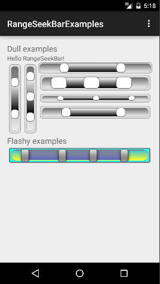

RangeSeekBarExamples
====================

Collection of examples using the [RangeSeekBar](https://github.com/Larpon/RangeSeekBar) Android view

---
## Screenshot

The screenshot shows current state of the example application.



## Building in Android Studio 1.x+
To build the examples in Android Studio you need to clone [RangeSeekBar](https://github.com/Larpon/RangeSeekBar) into a 'libs' folder.
```
cd /path/to/RangeSeekBarExamples
mkdir libs
cd libs
git clone git@github.com:Larpon/RangeSeekBar.git
```
From here on the examples should build and run as expected.

## Examples

Sparse usage examples are included in the repository.

To see how it is used with XML see the [res/layout/main.xml](res/layout/main.xml).

A typical use from a Main activity would look like:

```java
public class Main extends Activity {
	private static final String TAG = "Main";

	@Override
	public void onCreate(Bundle savedInstanceState) {
        super.onCreate(savedInstanceState);

        setContentView(R.layout.main);

        final RangeSeekBar rsb = (RangeSeekBar) findViewById(R.id.rangeSeekBarView1);
		rsb.setListener(new RangeSeekBarListener(){

			@Override
			public void onCreate(int index, float value) {
				// TODO Auto-generated method stub
			}

			@Override
			public void onSeek(int index, float value) {
				float f = 0.5f;
				float rounded = f * Math.round(value/f);
				((TextView) findViewById(R.id.hello))
					.setText("index: "+index+" val: "+rounded);
			}

		});
	}
}
```

To instantiate a RangeSeekBar from code without the use of XML do:

```java
RangeSeekBar rangeSeekBar = new RangeSeekBar(Context);
```

or

```java
RangeSeekBar rangeSeekBar = new RangeSeekBar(Context,AttributeSet);
```
